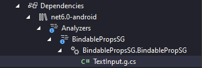

# BindableProps

[](https://www.nuget.org/packages/BindableProps/) 

> I spend hours to save your moments.

This library helps you to reduce writing boilerplate code when creating your custom UI components.

## `BindableProp` - Basic Usage

Let say you want to create your own text input. Here's how it looks:

```c#
namespace MyMauiApp.Controls;

public class TextInput : ContentView
{
    public string Text
    {
        get => (string)GetValue(TextInput.TextProperty);
        set => SetValue(TextInput.TextProperty, value);
    }

    public static readonly BindableProperty TextProperty = BindableProperty.Create(
        nameof(Text), typeof(string), typeof(TextInput), string.Empty
        );

    public string PlaceHolder
    {
        get => (string)GetValue(TextInput.PlaceHolderProperty);
        set => SetValue(TextInput.PlaceHolderProperty, value);
    }

    public static readonly BindableProperty PlaceHolderProperty = BindableProperty.Create(
        nameof(PlaceHolder), typeof(string), typeof(TextInput), string.Empty
        );


    public TextInput()
    {
        // Implement your logic
    }
}
```


With `BindableProps`, your code will become like this:

```c#
using BindableProps;

namespace MyMauiApp.Controls;

// Notice: Your class must be partial class
public partial class TextInput : ContentView
{
    [BindableProp]
    string text;

    [BindableProp]
    string placeHolder;


    public TextInput()
    {
        // This piece is same as above
    }
}
```

The real magic happens at Solution Explorer > Dependencies > Analyzers > BindablePropsSG



What you would see in `TextInput.g.cs` is the boilerplate code which you had to write. I'll write them for you!

```c#
using BindableProps;

namespace MyMauiApp.Controls
{
    public partial class TextInput
    {

        public static readonly BindableProperty TextProperty = BindableProperty.Create(
            nameof(Text),
            typeof(string),
            typeof(TextInput),
            default,
            (BindingMode)0,
            null,
            (bindable, oldValue, newValue) => 
                        ((TextInput)bindable).Text = (string)newValue,
            null,
            null,
            null
        );

        public string Text
        {
            get => text;
            set 
            { 
                OnPropertyChanging(nameof(Text));

                text = value;
                SetValue(TextInput.TextProperty, text);

                OnPropertyChanged(nameof(Text));
            }
        }

        public static readonly BindableProperty PlaceHolderProperty = BindableProperty.Create(
            nameof(PlaceHolder),
            typeof(string),
            typeof(TextInput),
            default,
            (BindingMode)0,
            null,
            (bindable, oldValue, newValue) => 
                        ((TextInput)bindable).PlaceHolder = (string)newValue,
            null,
            null,
            null
        );

        public string PlaceHolder
        {
            get => placeHolder;
            set 
            { 
                OnPropertyChanging(nameof(PlaceHolder));

                placeHolder = value;
                SetValue(TextInput.PlaceHolderProperty, placeHolder);

                OnPropertyChanged(nameof(PlaceHolder));
            }
        }

    }
}
```


The above example is the minimal amount of code to work. Here is the complete features:

```c#
public partial class TextInput : ContentView
{
    // Create prop with a few settings
    [BindableProp(DefaultBindingMode = ((int)BindingMode.TwoWay))]
    string text = "From every time";

    // Full setting
    [BindableProp(
        DefaultBindingMode = ((int)BindingMode.OneWay),
        ValidateValueDelegate = nameof(ValidateValue),
        PropertyChangedDelegate = nameof(PropertyChangedDelegate),
        PropertyChangingDelegate = nameof(PropertyChangingDelegate),
        CoerceValueDelegate = nameof(CoerceValueDelegate),
        CreateDefaultValueDelegate = nameof(CreateDefaultValueDelegate)
        )]
    string placeHolder = "Always!";

    static bool ValidateValue(BindableObject bindable, object value)
    {
        return true;
    }

    static void PropertyChangedDelegate(BindableObject bindable, object oldValue, object newValue)
    {
        // Do something
    }

    static void PropertyChangingDelegate(BindableObject bindable, object oldValue, object newValue)
    {
        // Do something
    }

    static object CoerceValueDelegate(BindableObject bindable, object value)
    {
        // Do something
        return 0;
    }

    static object CreateDefaultValueDelegate(BindableObject bindable)
    {
        // Do something
        return string.Empty;
    }
}
```


And the corresponding result would like:

```c#
public partial class TextInput
    {
        public static readonly BindableProperty TextProperty = BindableProperty.Create(
            nameof(Text),
            typeof(string),
            typeof(TextInput),
            "From every time",
            (BindingMode)((int)BindingMode.TwoWay),
            null,
            (bindable, oldValue, newValue) => 
                        ((TextInput)bindable).Text = (string)newValue,
            null,
            null,
            null
        );

        public string Text
        {
            get => text;
            set 
            { 
                OnPropertyChanging(nameof(Text));

                text = value;
                SetValue(TextInput.TextProperty, text);

                OnPropertyChanged(nameof(Text));
            }
        }

        public static readonly BindableProperty PlaceHolderProperty = BindableProperty.Create(
            nameof(PlaceHolder),
            typeof(string),
            typeof(TextInput),
            "Always!",
            (BindingMode)((int)BindingMode.OneWay),
            ValidateValue,
            PropertyChangedDelegate,
            PropertyChangingDelegate,
            CoerceValueDelegate,
            CreateDefaultValueDelegate
        );

        public string PlaceHolder
        {
            get => placeHolder;
            set 
            { 
                OnPropertyChanging(nameof(PlaceHolder));

                placeHolder = value;
                SetValue(TextInput.PlaceHolderProperty, placeHolder);

                OnPropertyChanged(nameof(PlaceHolder));
            }
        }

    }
```


Finally, you can use your component in other page/view like a normal component. For example, at `MainPage.xaml`:

```xaml
<?xml version="1.0" encoding="utf-8" ?>
<ContentPage xmlns="http://schemas.microsoft.com/dotnet/2021/maui"
             xmlns:x="http://schemas.microsoft.com/winfx/2009/xaml"
             xmlns:vm="clr-namespace:MyMauiApp.ViewModels"
             xmlns:controls="clr-namespace:MyMauiApp.Controls"
             x:Class="MyMauiApp.MainPage"
             x:DataType="vm:MainPageViewModel">
    
    <controls:TextInput PlaceHolder="Say you do"
                        Text="{Binding MyLoveStory, Mode=TwoWay}" />
</ContentPage>
```


## `AllBindableProps` and `IgnoredProp`

If you just need the default setting for all of your props, try this:

```c#
[AllBindableProps]
public partial class TextInput : ContentView
{
    // Default field
    string text;

    // Support field with a default value
    string placeHolder = "Do you trust me?";

    // This field will be handled by BindableProp
    [BindableProp(
        DefaultBindingMode = (int)BindingMode.TwoWay,
        ValidateValueDelegate = nameof(ValidateValue)
        )]
    string message = "With every cell in my body!";

    [IgnoredProp]
    bool isBusy; // Don't touch!

    // If you have existing props, we don't touch them
    public static readonly BindableProperty ErrorProperty = BindableProperty.Create(
            nameof(Error),
            typeof(string),
            typeof(TextInput),
            "Things just get out of hand",
            (BindingMode)(int)BindingMode.OneWayToSource
        );

    // Also not touch this prop
    public string Error
    {
        get => (string)GetValue(TextInput.ErrorProperty);
        set
        {
            SetValue(TextInput.ErrorProperty, value);
        }
    }

    static bool ValidateValue(BindableObject bindable, object value)
    {
        return true;
    }
    
    public TextInput()
    {
        InitializeComponent();
    }
}
```

And the result is:

```c#
namespace WibuTube.Controls
{
    public partial class TextInput
    {
        public static readonly BindableProperty TextProperty = BindableProperty.Create(
                    nameof(Text),
                    typeof(string),
                    typeof(TextInput),
                    default,
                    propertyChanged: (bindable, oldValue, newValue) =>
                                    ((TextInput)bindable).Text = (string)newValue
                );

        public string Text
        {
            get => text;
            set 
            { 
                OnPropertyChanging(nameof(Text));

                text = value;
                SetValue(TextInput.TextProperty, text);

                OnPropertyChanged(nameof(Text));
            }
        }

        public static readonly BindableProperty PlaceHolderProperty = BindableProperty.Create(
                    nameof(PlaceHolder),
                    typeof(string),
                    typeof(TextInput),
                    "Do you trust me?",
                    propertyChanged: (bindable, oldValue, newValue) =>
                                    ((TextInput)bindable).PlaceHolder = (string)newValue
                );

        public string PlaceHolder
        {
            get => placeHolder;
            set 
            { 
                OnPropertyChanging(nameof(PlaceHolder));

                placeHolder = value;
                SetValue(TextInput.PlaceHolderProperty, placeHolder);

                OnPropertyChanged(nameof(PlaceHolder));
            }
        }

    }
}
```


## Roadmap

The `BindableProp` along is just not enough for covering all use-cases of `BindableProperty`. Planning features:

| Attribute                      | Equivalent/Description                                       | Status    |
| ------------------------------ | ------------------------------------------------------------ | --------- |
| `BindableAttachedProp`         | `BindableProperty.CreateAttached`                            |           |
| `BindableAttachedReadOnlyProp` | `BindablePropertyKey.CreateAttachedReadOnly`                 |           |
| `BindableReadOnlyProp`         | `BindablePropertyKey.CreateReadOnly`                         |           |
| `AllBindableProps`             | Put this to your class,<br />Default `BindableProp` to all field members | :ok_hand: |
| `IgnoredProp`                  | `AllBindableProps` should ignore this field                  | :ok_hand: |

