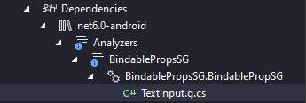

# Simple Usage

Let say you want to create your own text input. Normally, here's how it looks:

```c#
namespace MyMauiApp.Controls;

public class TextInput : ContentView
{
    public string Text
    {
        get => (string)GetValue(TextInput.TextProperty);
        set => SetValue(TextInput.TextProperty, value);
    }

    public static readonly BindableProperty TextProperty = BindableProperty.Create(
        nameof(Text), typeof(string), typeof(TextInput), string.Empty
        );

    public string PlaceHolder
    {
        get => (string)GetValue(TextInput.PlaceHolderProperty);
        set => SetValue(TextInput.PlaceHolderProperty, value);
    }

    public static readonly BindableProperty PlaceHolderProperty = BindableProperty.Create(
        nameof(PlaceHolder), typeof(string), typeof(TextInput), string.Empty
        );


    public TextInput()
    {
        // Implement your logic
    }
}
```

With `BindableProp`, your code will become like this and done:
```c#
using BindableProps;

namespace MyMauiApp.Controls;

// Notice: Your class must be partial class
public partial class TextInput : ContentView
{
    [BindableProp]
    string text;

    [BindableProp]
    string placeHolder;


    public TextInput()
    {
        // This piece is same as above
    }
}
```


The real magic happens at Solution Explorer > Dependencies > Analyzers > BindablePropsSG



What you would see in `TextInput.g.cs` is the boilerplate code which you had to write. I'll write them for you!

```c#
using BindableProps;

namespace MyMauiApp.Controls
{
    public partial class TextInput
    {

        public static readonly BindableProperty TextProperty = BindableProperty.Create(
            nameof(Text),
            typeof(string),
            typeof(TextInput),
            default,
            (BindingMode)0,
            null,
            (bindable, oldValue, newValue) => 
                        ((TextInput)bindable).Text = (string)newValue,
            null,
            null,
            null
        );

        public string Text
        {
            get => text;
            set 
            { 
                OnPropertyChanging(nameof(Text));

                text = value;
                SetValue(TextInput.TextProperty, text);

                OnPropertyChanged(nameof(Text));
            }
        }

        public static readonly BindableProperty PlaceHolderProperty = BindableProperty.Create(
            nameof(PlaceHolder),
            typeof(string),
            typeof(TextInput),
            default,
            (BindingMode)0,
            null,
            (bindable, oldValue, newValue) => 
                        ((TextInput)bindable).PlaceHolder = (string)newValue,
            null,
            null,
            null
        );

        public string PlaceHolder
        {
            get => placeHolder;
            set 
            { 
                OnPropertyChanging(nameof(PlaceHolder));

                placeHolder = value;
                SetValue(TextInput.PlaceHolderProperty, placeHolder);

                OnPropertyChanged(nameof(PlaceHolder));
            }
        }

    }
}
```


# Full Usage

The above example is the minimal amount of code to work. Here is an example of the complete features:

```c#
public partial class TextInput : ContentView
{
    // Create prop with a few settings
    [BindableProp(DefaultBindingMode = ((int)BindingMode.TwoWay))]
    string text = "From every time";

    // Full setting
    [BindableProp(
        DefaultBindingMode = ((int)BindingMode.OneWay),
        ValidateValueDelegate = nameof(ValidateValue),
        PropertyChangedDelegate = nameof(PropertyChangedDelegate),
        PropertyChangingDelegate = nameof(PropertyChangingDelegate),
        CoerceValueDelegate = nameof(CoerceValueDelegate),
        CreateDefaultValueDelegate = nameof(CreateDefaultValueDelegate)
        )]
    string placeHolder = "Always!";

    static bool ValidateValue(BindableObject bindable, object value)
    {
        return true;
    }

    static void PropertyChangedDelegate(BindableObject bindable, object oldValue, object newValue)
    {
        // Do something
    }

    static void PropertyChangingDelegate(BindableObject bindable, object oldValue, object newValue)
    {
        // Do something
    }

    static object CoerceValueDelegate(BindableObject bindable, object value)
    {
        // Do something
        return 0;
    }

    static object CreateDefaultValueDelegate(BindableObject bindable)
    {
        // Do something
        return string.Empty;
    }
}
```

And the corresponding result would like:

```c#
public partial class TextInput
    {
        public static readonly BindableProperty TextProperty = BindableProperty.Create(
            nameof(Text),
            typeof(string),
            typeof(TextInput),
            "From every time",
            (BindingMode)((int)BindingMode.TwoWay),
            null,
            (bindable, oldValue, newValue) => 
                        ((TextInput)bindable).Text = (string)newValue,
            null,
            null,
            null
        );

        public string Text
        {
            get => text;
            set 
            { 
                OnPropertyChanging(nameof(Text));

                text = value;
                SetValue(TextInput.TextProperty, text);

                OnPropertyChanged(nameof(Text));
            }
        }

        public static readonly BindableProperty PlaceHolderProperty = BindableProperty.Create(
            nameof(PlaceHolder),
            typeof(string),
            typeof(TextInput),
            "Always!",
            (BindingMode)((int)BindingMode.OneWay),
            ValidateValue,
            PropertyChangedDelegate,
            PropertyChangingDelegate,
            CoerceValueDelegate,
            CreateDefaultValueDelegate
        );

        public string PlaceHolder
        {
            get => placeHolder;
            set 
            { 
                OnPropertyChanging(nameof(PlaceHolder));

                placeHolder = value;
                SetValue(TextInput.PlaceHolderProperty, placeHolder);

                OnPropertyChanged(nameof(PlaceHolder));
            }
        }

    }
```

Finally, you can use your component in other page/view like a normal component. For example, at `MainPage.xaml`:

```xaml
<?xml version="1.0" encoding="utf-8" ?>
<ContentPage xmlns="http://schemas.microsoft.com/dotnet/2021/maui"
             xmlns:x="http://schemas.microsoft.com/winfx/2009/xaml"
             xmlns:vm="clr-namespace:MyMauiApp.ViewModels"
             xmlns:controls="clr-namespace:MyMauiApp.Controls"
             x:Class="MyMauiApp.MainPage"
             x:DataType="vm:MainPageViewModel">
    
    <controls:TextInput PlaceHolder="Say you do"
                        Text="{Binding MyLoveStory, Mode=TwoWay}" />
</ContentPage>
```